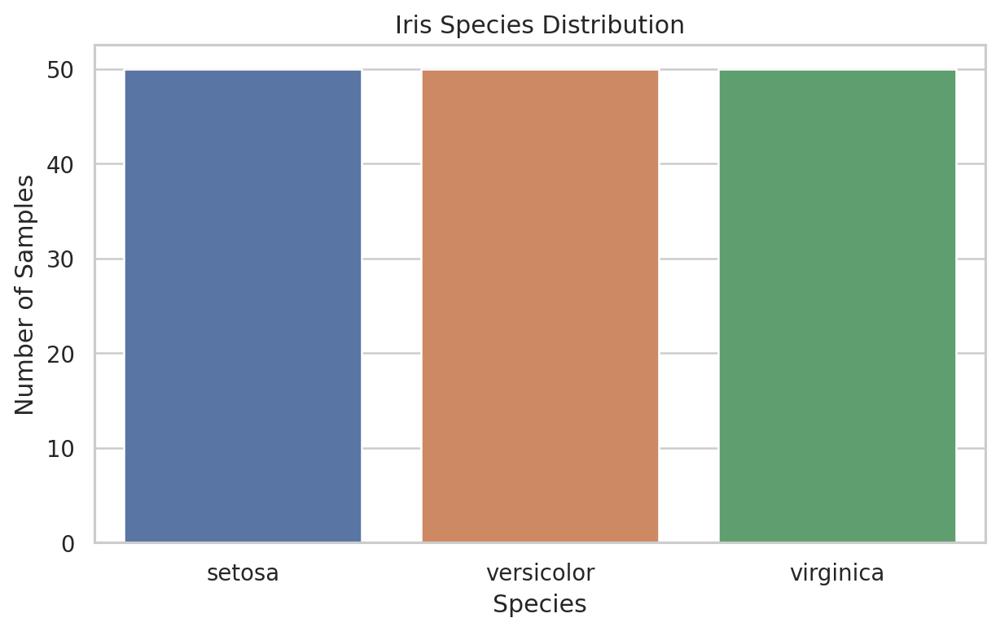
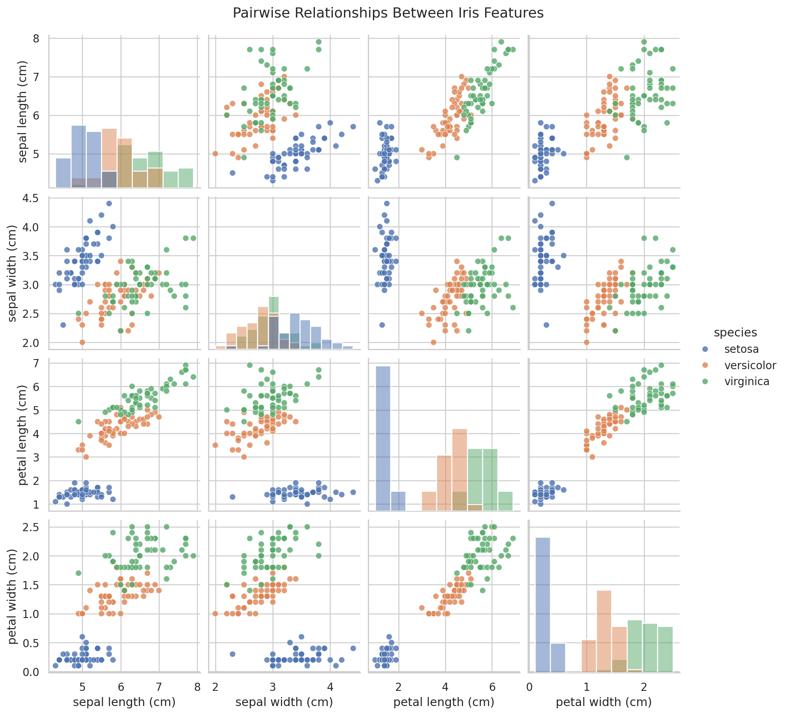
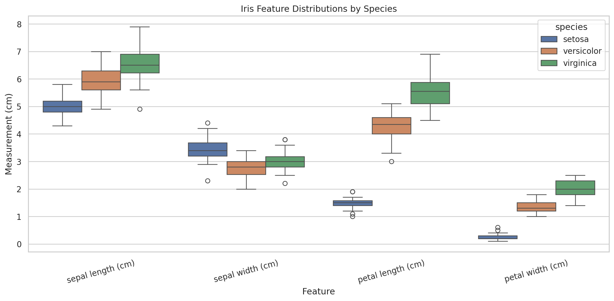
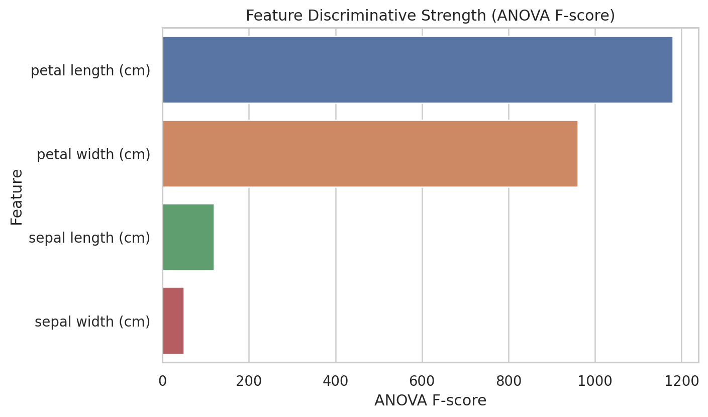
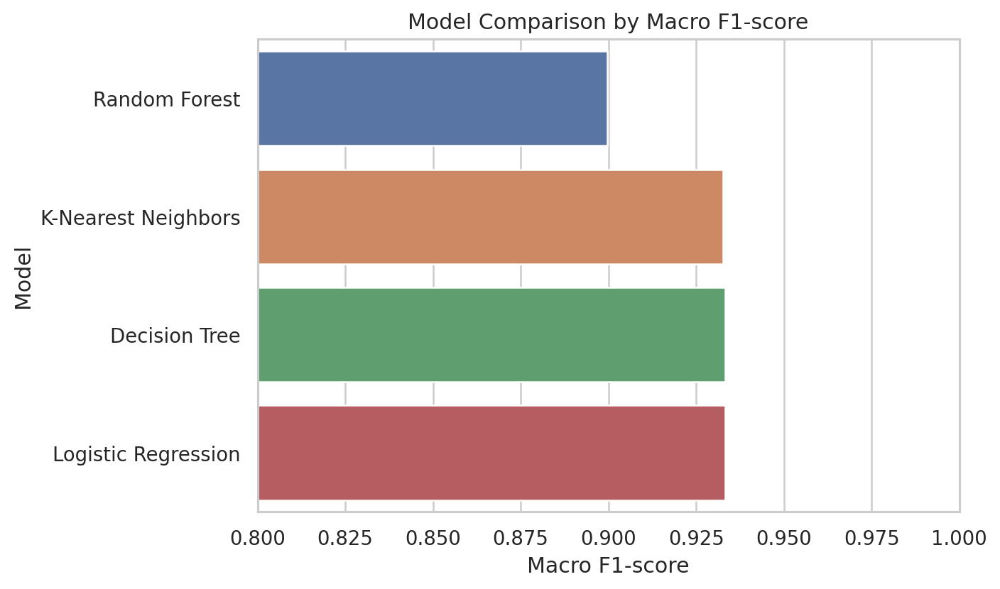
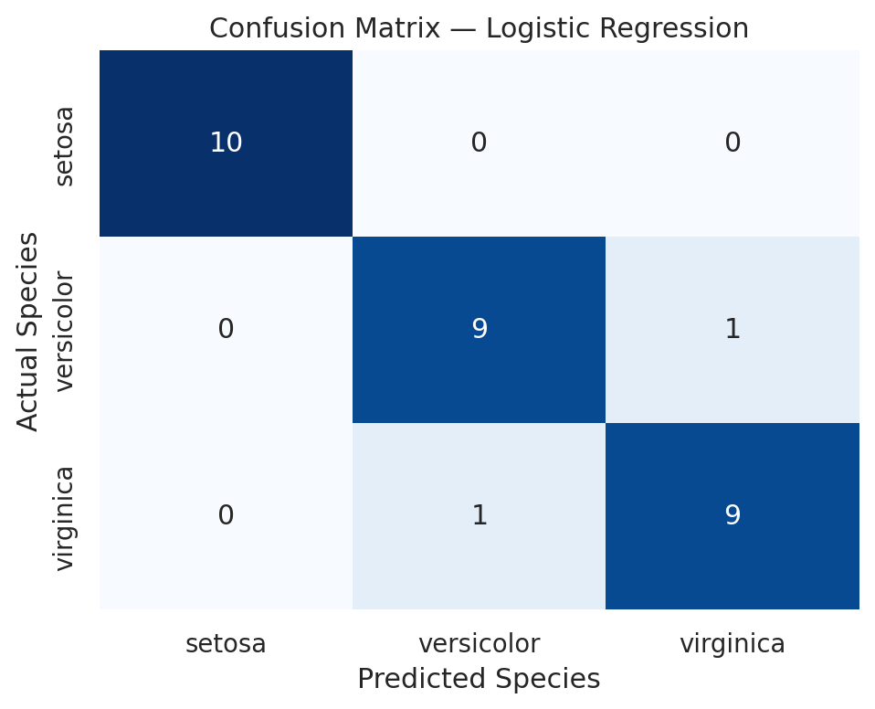

# Iris Flower Classification

**Oasis Infobyte — Data Science Internship**  
**Task 1 — Iris Flower Classification**  
**Author:** Md. Zayed Hossain

## Objective

Build a reproducible machine-learning workflow that classifies Iris flowers as **Setosa**, **Versicolor**, or **Virginica** from their physical measurements and compares multiple classification algorithms using real evaluation results.

## Problem Statement

The Iris dataset contains four measurements for each flower: sepal length, sepal width, petal length, and petal width. The goal is to train models that learn the relationship between these measurements and the flower species, then evaluate their performance on unseen test data.

## Dataset

- **Dataset:** Iris dataset from `sklearn.datasets.load_iris()`
- **External download required:** No
- **Samples:** 150
- **Input features:** 4
- **Classes:** Setosa, Versicolor, Virginica
- **Class balance:** 50 samples per species
- **Missing values:** 0
- **Exact duplicate observations:** 1 (reviewed and retained to preserve the canonical scikit-learn dataset)

### Features

1. Sepal length (cm)
2. Sepal width (cm)
3. Petal length (cm)
4. Petal width (cm)

### Target

The target is the Iris species label:

- `0` → Setosa
- `1` → Versicolor
- `2` → Virginica

## Technologies Used

- Python
- pandas
- scikit-learn
- matplotlib
- seaborn
- Jupyter Notebook

## Project Workflow

1. Load the built-in Iris dataset.
2. Inspect shape, columns, data types, metadata, missing values, duplicates, and descriptive statistics.
3. Analyze class distribution and feature relationships.
4. Create the required pairplot and feature box plots.
5. Quantify feature discriminative strength with ANOVA F-scores.
6. Split data using an 80/20 stratified train/test split with `random_state=42`.
7. Use leakage-safe scaling pipelines for Logistic Regression and KNN.
8. Train four classifiers.
9. Evaluate all models using accuracy, precision, recall, F1-score, confusion matrices, and classification reports.
10. Compare models and select the best using test macro F1, accuracy, and cross-validation as a tie-breaker.

## Exploratory Data Analysis Summary

### Species Distribution



The dataset is perfectly balanced with 50 examples from each species.

### Pairplot



The pairplot shows that **petal length** and **petal width** provide much clearer separation between species than the sepal measurements. Setosa is especially distinct, while Versicolor and Virginica overlap more.

### Feature Box Plots



The box plots confirm that petal dimensions have stronger between-species differences. Sepal width shows the greatest overlap and is less discriminative on its own.

### Feature Discriminative Strength

The ANOVA analysis ranks the strongest features as:

1. **Petal length (cm)** — F-score ≈ 1180.16
2. **Petal width (cm)** — F-score ≈ 960.01

These results support the visual evidence from the pairplot and box plots.



## Models Used

1. **Logistic Regression** — scaled using `StandardScaler` inside a pipeline.
2. **K-Nearest Neighbors** — scaled using `StandardScaler` inside a pipeline.
3. **Decision Tree** — tree-based classifier that does not require feature scaling.
4. **Random Forest** — ensemble of decision trees.

## Evaluation Metrics

- **Accuracy:** proportion of all correct predictions.
- **Precision:** how many predicted samples for a class are actually correct.
- **Recall:** how many actual samples of a class are correctly identified.
- **F1-score:** harmonic mean of precision and recall.
- **Confusion Matrix:** class-by-class view of correct and incorrect predictions.
- **Classification Report:** per-class precision, recall, and F1-score.

Macro-averaged metrics are used so all three classes contribute equally.

## Actual Model Results

| Model | Accuracy | Precision (Macro) | Recall (Macro) | F1-score (Macro) | CV F1 Mean |
|---|---:|---:|---:|---:|---:|
| Logistic Regression | 0.9333 | 0.9333 | 0.9333 | 0.9333 | 0.9580 |
| Decision Tree | 0.9333 | 0.9333 | 0.9333 | 0.9333 | 0.9496 |
| K-Nearest Neighbors | 0.9333 | 0.9444 | 0.9333 | 0.9327 | 0.9580 |
| Random Forest | 0.9000 | 0.9024 | 0.9000 | 0.8997 | 0.9494 |



## Best-Performing Model

**Selected model: Logistic Regression**

- Test Accuracy: **0.9333 (93.33%)**
- Macro Precision: **0.9333**
- Macro Recall: **0.9333**
- Macro F1-score: **0.9333**
- 5-fold CV Macro F1 Mean: **0.9580**

Logistic Regression and Decision Tree tied on held-out test accuracy and macro F1. Logistic Regression was selected because its mean 5-fold cross-validation macro F1 was higher, providing stronger evidence of stability across training folds. KNN also reached the same test accuracy but had a slightly lower macro F1. Random Forest reached 90% test accuracy in this fixed split.

### Logistic Regression Confusion Matrix



The model correctly classified all 10 Setosa test samples. Its two test errors were between Versicolor and Virginica, which is consistent with the overlap visible in the EDA.

## Key Insights

- Petal length and petal width are the most discriminative Iris features.
- Setosa is the easiest species to separate visually and statistically.
- Versicolor and Virginica are the main source of classification overlap.
- Scaling is performed inside pipelines, preventing test-data leakage.
- Multiple classical models perform strongly, but cross-validation helps make a more defensible choice when test metrics are very close.

## Project Structure

```text
OIBSIP/
└── DataScience-Task1-IrisFlowerClassification/
    ├── README.md
    ├── iris_flower_classification.ipynb
    ├── requirements.txt
    ├── run_project.sh
    ├── SUBMISSION_GUIDE.md
    ├── images/
    │   ├── species_distribution.png
    │   ├── iris_pairplot.png
    │   ├── feature_boxplots.png
    │   ├── feature_correlation_heatmap.png
    │   ├── feature_discriminative_scores.png
    │   ├── model_comparison_f1.png
    │   └── confusion_matrix_*.png
    └── outputs/
        ├── model_comparison.csv
        ├── classification_reports.txt
        ├── feature_discriminative_scores.csv
        └── best_model_summary.txt
```

## How to Run

### Option 1 — Standard setup

```bash
cd DataScience-Task1-IrisFlowerClassification
python -m pip install -r requirements.txt
jupyter notebook iris_flower_classification.ipynb
```

Run all notebook cells from top to bottom.

### Option 2 — Bash helper

```bash
chmod +x run_project.sh
./run_project.sh
```

The helper creates a local virtual environment, installs the required packages, and opens the notebook.

## GitHub Repository

Main repository name: **`OIBSIP`**

Project location:

```text
OIBSIP/DataScience-Task1-IrisFlowerClassification/
```

Repository URL placeholder: `<YOUR_GITHUB_REPOSITORY_URL>`

## Conclusion

This project demonstrates a complete classification workflow using the Iris dataset. The analysis shows that petal measurements carry the strongest species-separation information. Four classifiers were trained and evaluated with the same reproducible split, and **Logistic Regression** was selected using the defined evidence-based ranking rule. All core outputs, evaluation reports, and visualizations are saved with the project for GitHub and internship submission use.
